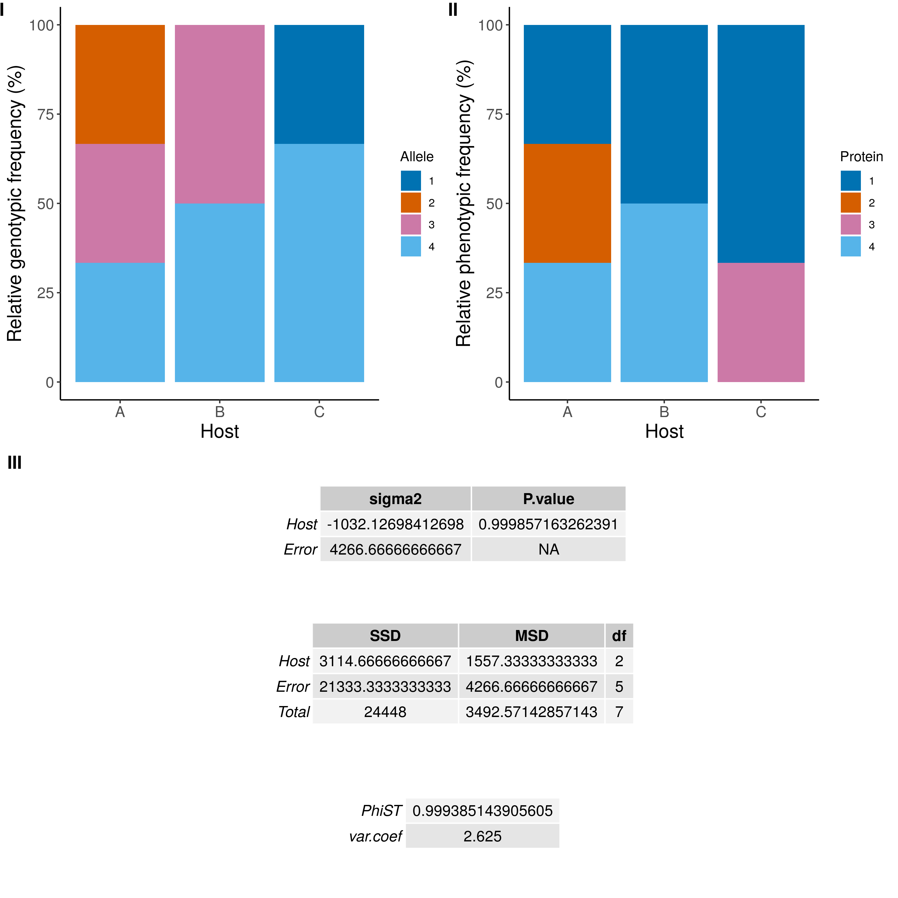
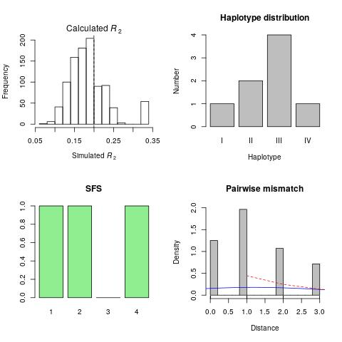

# Popgen suite

A suite of scripts for basic population genetic analysis from fasta sequences that can be implemented in analysis pipelines. Developed during my PhD at Kingston University.  

Problem: Preparation of input files for popgen analyses can be laborious, particularly if you only want to run basic analyses, and most popgen software cannot be easily implimented into automated pipelines. 

Solution: Popgen-suite makes it easy to run basic population statistics, requiring a fasta file and a csv file to define population groups. Analyses can be carried out using separate scripts, enabling integration into automated pipelines.  

## Allele and protein variant prediction.  

 **1. Predicting Allele and Protein variants.**    
From a population sample of fasta sequences `cluster_finder.py` will predict how many alleles are present (based on 100% sequence identity) and their counts. Running the same script on the translated sequences will predict the protein variants and their counts (can be used on any kind of sequence or string).   

Given a multi-fasta file `cluster_finder.py` sorts sequences into identical groups and returns tables of counts and cluster ids for plotting and further analysis.  

       Example: cluster_finder.py   test.fasta   test
       

**2. Plotting Relative Allele and Protein variant frequencies in multiple populations** (e.g different host populations or geographic regions).

After running `cluster_finder.py` on both protein and nucleotide data sets, the output from both predictions can be merged.  
Running `Relative_geno_pheno_plots.R` will sort this output so that a comparative plot of Relative genotypic and phenotypic frequencies is produced.  

    Example of usage: Relative_geno_pheno_plots.R  test_nucl_cluster_members.csv  test_prot_cluster_members.csv   group_info.csv 
  
To test for any evidence in population structure observed in the final plot an AMOVA can be run using pegas (note this is a one factor amova - host ~ genotype).    
       
   

  

## Population frequency statistics

Running `Relative_geno_pheno_plots.R` also produces R2, haplotype, SFS and pairwise mismatch distribution plots.  

### SFS 
Folded site frequency spectrum analysis (SFS) summarises the number of haplotypes segregating at different frequencies in a population. SFS plots compare minor allele frequencies (the frequency of the second most frequent allele for a given mutation) to the number of mutations. Under neutrality there is expected to be a range of haplotype frequencies, where constant effective population size is assumed.      

### Ramos-Onsins-Rozas's test
R2 test or Ramos-Onsins and Rozas's test of neutrality (Ramos-Onsins and Rozas 2002) a small positive value indicates an excess of low frequency mutations which can be a result of population expansion. Rozas-Osins test can be preffered over Fu Li’s F test for smaller datasets due to its increased sensitivity.     

### Pairwise mismatch 
The mismatch distribution represents the frequency of the number of nucleotide sites which differ between all unique pairs of DNA sequences from a population where the more nucleotide sites which differ from unique sequence pairs the older the mutations are considered to be.      

### Haplotype diversity and nucleotide diversity 
the comparison of these values can indicate population demographic changes for example, if haplotype diversity is higher than nucleotide diversity in a population this can be indicative of a population expansion event after a population has experienced a bottleneck

     

## Automated prediction and Relative frequency plotting. 

In `Relative_freq_plots.sh` steps 1 and 2 above are combined.  

     Example of usage: ./Relative_freq_plots.sh   test.fasta   test.translated.fasta   test   group_info.csv   Host

Notes on usage:  
- Column names must be the same as shown in the test files (see group_info.csv).  
- Relative frequencies and sorted allele and protein variation information for each individual in the dataset is always ouput as:  
`group_allele_counts.csv`, `group_protein_counts.csv` and `Allele_and_protein_variants.csv`  

     

## Per site analyses of Tajima's D and Pi.

coming soon...
     

## Citation  

This work is still under development but if you use these scripts in your work please cite it as:

Eldridge, C.J.L, Majoros, G., Cook, R.T., Kidd, D., Emery, A.M., Lawton, S.P. (2021). Popgen-suite [Software]. Unpublished.  

If you use `Relative_geno_pheno_plots.R` please also cite:  

Paradis E (2010). “pegas: an R package for population genetics with an integrated–modular approach.” Bioinformatics, 26, 419-420. doi:10.1093/bioinformatics/btp696.  

Paradis E, Schliep K (2019). “ape 5.0: an environment for modern phylogenetics and evolutionary analyses in R.” Bioinformatics, 35, 526-528. doi:10.1093/bioinformatics/bty633.  

     

Shield: [![CC BY 4.0][cc-by-shield]][cc-by]

This work is licensed under a
[Creative Commons Attribution 4.0 International License][cc-by].

[![CC BY 4.0][cc-by-image]][cc-by]

[cc-by]: http://creativecommons.org/licenses/by/4.0/
[cc-by-image]: https://i.creativecommons.org/l/by/4.0/88x31.png
[cc-by-shield]: https://img.shields.io/badge/License-CC%20BY%204.0-lightgrey.svg

