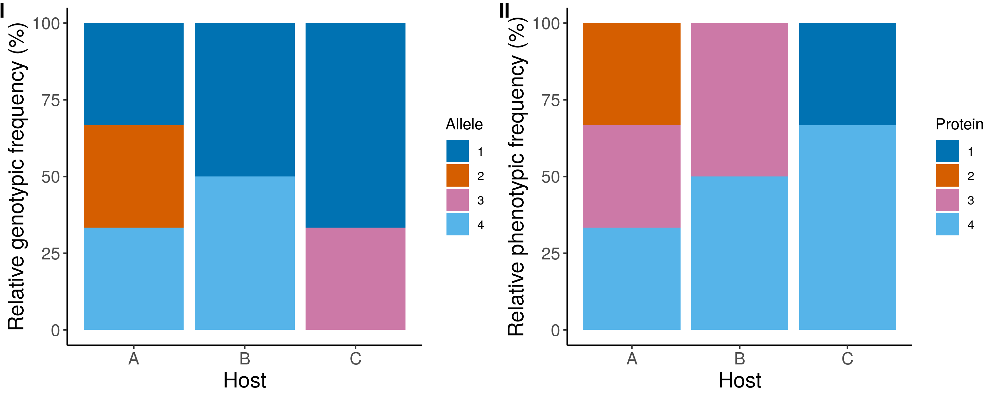

# Popgen suite

A suite of scripts for basic population genetic analysis from fasta sequences.
     

Problem: Most software for population analyses requires the preparation of input files which can be laborious, particularly if you only want to run basic                                population analyses. 

Solution: Popgen-suite makes it easy to run basic population statistics, requiring a fasta file and a simple csv file to define population groups.

     

## Tools

**Allele and protein variant prediction from a population sample**

 

### 1. Predicting Allele and Protein variants.        

`cluster_finder.py` clusters sequences based on 100% identity and can be used on any kind of sequence or string.      

From a population sample of fasta sequences cluster_finder.py will predict how many alleles are present and allele counts. Running the same script 
on the translated sequences will predict the protein variants and their counts.     

     

`cluster_finder.py`

- Given multi-fasta file, sorts sequences into identical groups (can be used to cluster any strings in fasta format by 100% id).     
- Returns tables of counts and cluster ids for plotting and further analysis.     

       Example: cluster_finder.py   test.fasta   test
       
       
     

### 2. Plotting Relative Allele and Protein variant frequencies in multiple populations (e.g different host populations or geographic regions).

After running `cluster_finder.py` on both protein and nucleotide data sets, the output from both predictions can be merged.     
Running `Relative_geno_pheno_plots.R` will sort this output so that a comparative plot of Relative genotypic and phenotypic frequencies is produced.     

    Example of usage: Relative_geno_pheno_plots.R  test_nucl_cluster_members.csv  test_prot_cluster_members.csv   group_info.csv 
    
    
     

     

To test for any evidence in population structure observed in the final plot an AMOVA can be calculated using pegas (see Population statistic summary tables).     

     

## Automated prediction and Relative frequency plotting. 

In `Relative_freq_plots.sh` steps 1 and 2 above are combined. 
     

     Example of usage: ./Relative_freq_plots.sh   test.fasta   test.translated.fasta   test   group_info.csv   Host
     

Notes on usage:
     
- Column names must be the same as shown in the test files (see group_info.csv).      
- Relative frequencies and sorted allele and protein variation information for each individual in the dataset is always ouput as:     
`group_allele_counts.csv`, `group_protein_counts.csv` and `Allele_and_protein_variants.csv`      

## Population statistic summary tables. 

coming soon...

